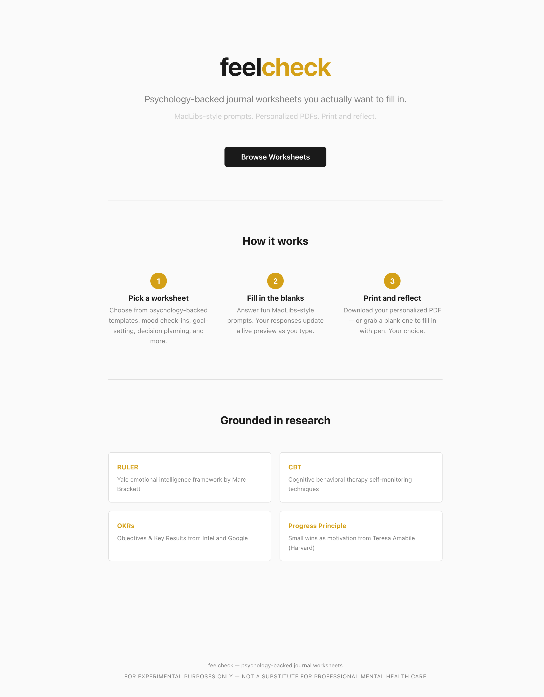
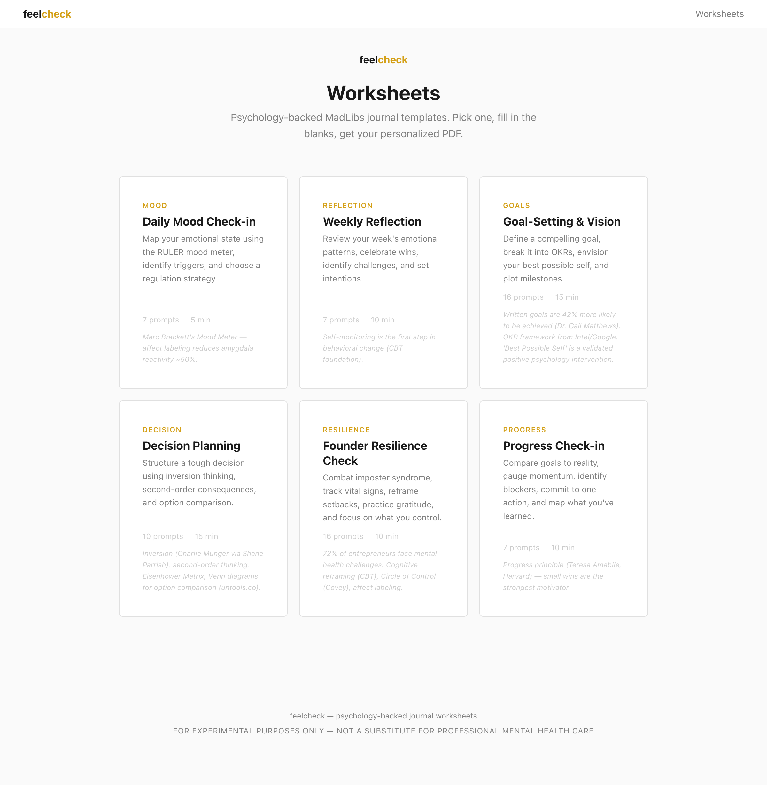
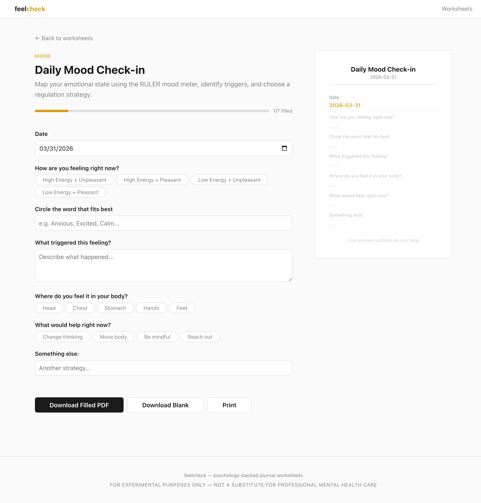
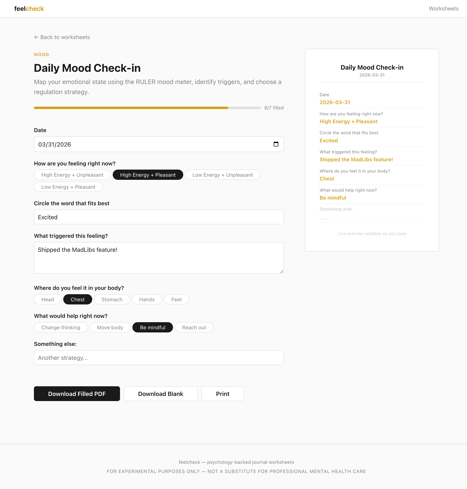
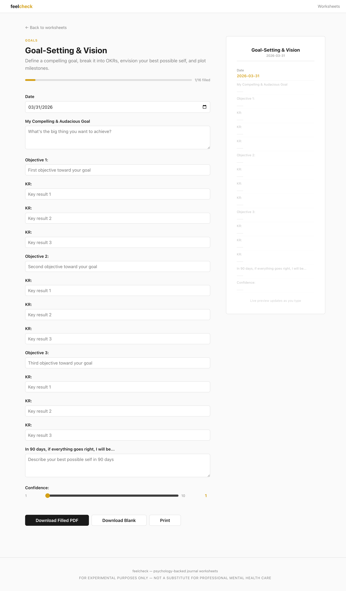
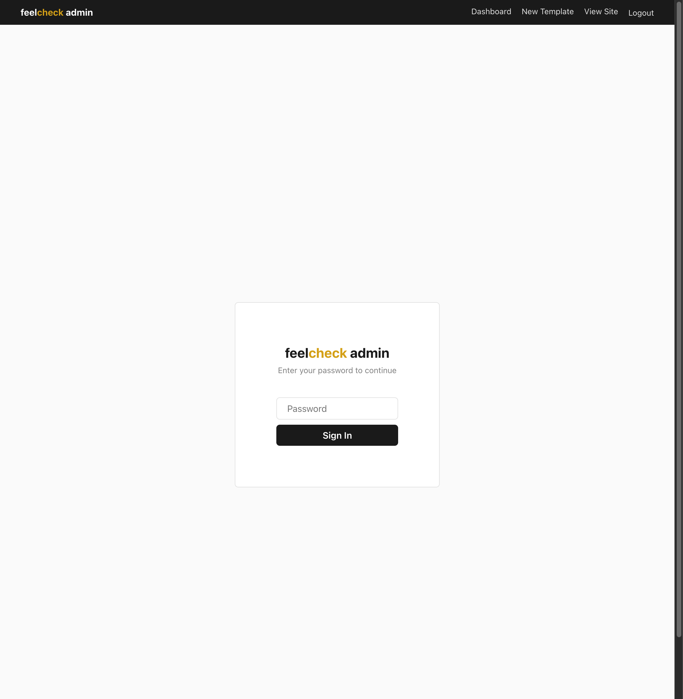

<p align="center">
  <h1 align="center">feelcheck</h1>
  <p align="center">Psychology-backed MadLibs journal worksheets.<br>Fill in the blanks. Get your personalized PDF. Print and reflect.</p>
  <p align="center">
    <a href="#madlibs-web"><strong>MadLibs Web</strong></a> ·
    <a href="#worksheets">Worksheets</a> ·
    <a href="#cli">CLI</a> ·
    <a href="#admin">Admin</a> ·
    <a href="ROADMAP.md">Roadmap</a> ·
    <a href="PROGRESS.md">Progress</a>
  </p>
  <p align="center">
    
    
    
    
    
  </p>
</p>

---

> **FOR EXPERIMENTAL PURPOSES ONLY**
> Not a substitute for professional mental health care.

---

## MadLibs Web


The heart of feelcheck — interactive fill-in-the-blank journal worksheets on the web.

**Browse** psychology-backed templates, **fill in** fun MadLibs-style prompts, and **download** your personalized PDF.

### Landing Page



### Browse Worksheets

Pick from 6 psychology-backed templates — mood check-ins, goal-setting, decision planning, founder resilience, and more.



### Fill in the Blanks

Interactive MadLibs form on the left, live preview on the right. Pill selectors, text inputs, scales — answers flow into the preview as you type.



### Live Preview Updates

Every answer appears in the preview instantly. Progress bar tracks completion. Download filled PDF, blank PDF, or print directly.



### More Worksheets

Each worksheet has its own set of psychology-backed prompts and visual components.



## Admin

Password-protected admin panel for managing templates — create custom worksheets, publish/unpublish, hide with token-based access.



**Features:**
- Template dashboard with status filters (published, draft, hidden)
- Visual template builder — add blanks, pick section types, live preview
- Access control — publish, hide with shareable token links, draft mode
- Single-admin password auth with session cookies

## Worksheets

| | Worksheet | What it does | Psychology |
|-|-----------|-------------|------------|
| 1 | **Daily Mood Check-in** | 36-emotion Mood Meter, triggers, body scan, regulation | RULER / Marc Brackett (Yale) |
| 2 | **Weekly Reflection** | 7-day tracker, patterns, wins & challenges | CBT self-monitoring |
| 3 | **Goal-Setting & Vision** | OKRs, milestone timeline, 90-day visualization | Matthews / Intel / Google |
| 4 | **Decision Planning** | Inversion, 2nd-order thinking, Venn, comparison | Shane Parrish / untools.co |
| 5 | **Founder Resilience** | Imposter check, vital signs, reframe, Circle of Control | CBT / Covey |
| 6 | **Progress Check-in** | Goals vs reality, momentum, Planned/Did/Learned Venn | Amabile (Harvard) |

## Quick Start

### Web (recommended)

```bash
cd web
npm install
npm run dev
```

Open http://localhost:5173 — browse worksheets, fill in MadLibs, download PDFs.

### CLI

```bash
zig build -Doptimize=ReleaseSmall
cp zig-out/bin/feelcheck /usr/local/bin/

feelcheck daily                    # mood check-in
feelcheck weekly                   # weekly reflection
feelcheck goals                    # goal-setting & vision
feelcheck decide                   # decision planning
feelcheck founder                  # founder resilience
feelcheck progress                 # progress check-in
feelcheck all                      # full 6-page workbook
feelcheck all -o my-journal.pdf    # custom output path
```

## Deploy to Vercel

```bash
cd web
vercel deploy
```

Set environment variables in the Vercel dashboard:

| Variable | Description |
|----------|-------------|
| `ADMIN_PASSWORD_HASH` | Bcrypt hash of your admin password |
| `TURSO_DATABASE_URL` | Turso database URL |
| `TURSO_AUTH_TOKEN` | Turso auth token |

Generate password hash: `node -e "require('bcryptjs').hash('your-password', 10).then(console.log)"`

## Architecture

```
web/                        SvelteKit MadLibs web app (NEW)
├── src/routes/             file-based routing ("the one tree")
│   ├── /                   landing page
│   ├── /worksheets         browse templates
│   ├── /play/[slug]        MadLibs fill-in experience
│   ├── /print/[slug]       PDF generation endpoint
│   └── /admin              template management (protected)
├── src/lib/
│   ├── schema/             template types, validation, resolution
│   ├── pdf/                pdf-lib rendering engine (17 components)
│   ├── db/                 Drizzle ORM + Turso SQLite
│   └── auth/               password + session management
templates/                  shared template JSON (6 worksheets)
lib/zpdf/                   zero-dep Zig PDF 1.4 writer
src/                        Zig CLI application
├── design.zig              18pt grid · golden ratio · 6-color palette
├── components.zig          15+ reusable visual components
├── worksheets/             one file per worksheet type
└── main.zig                CLI entry point
```

### Tech Stack

| Layer | Technology |
|-------|-----------|
| Web framework | SvelteKit (Svelte 5 runes) |
| Hosting | Vercel (adapter-vercel) |
| Database | Turso SQLite + Drizzle ORM |
| PDF (web) | pdf-lib |
| PDF (CLI) | zpdf (Zig, zero-dep) |
| Auth | bcrypt + session cookies |
| Styling | CSS custom properties |
| Template format | JSON schema (shared) |

## Design Principles

- **John Maeda simplicity** — mathematical grid, minimal palette, maximum whitespace
- **Kindergarten pre-fill** — every prompt has a visible box, circle, or line inviting the pen
- **MadLibs-first** — fill-in-the-blank prompts that are fun, not clinical
- **One tree** — file-based routing IS the product structure
- **SRP modularity** — general problem (PDF library) separated from specific problem (worksheets)
- **Dual rendering** — same templates drive both web (pdf-lib) and CLI (Zig zpdf)
- **Blackbox archive** — every worksheet version is permanently documented, never deleted

## Table of Contents

```
README.md                       you are here
PROGRESS.md                     development log (append-only)
ROADMAP.md                      future direction
web/                            SvelteKit web app
web/README.md                   web-specific docs
templates/                      shared worksheet JSON templates
docs/archive/                   worksheet archive (blackbox, never delete)
docs/screenshots/               app screenshots
docs/superpowers/specs/         design specifications
lib/zpdf/                       Zig PDF generation library
src/                            Zig CLI source
build.zig                       Zig build configuration
```

## Psychology References

- Marc Brackett — *Permission to Feel*, RULER framework, Mood Meter
- Shane Parrish — *The Great Mental Models*, inversion, second-order thinking
- Teresa Amabile — *The Progress Principle*, small wins
- Stephen Covey — *The 7 Habits*, Circle of Control
- Dr. Gail Matthews — Written goals research
- [untools.co](https://untools.co) — Thinking tools and frameworks

---

<p align="center">
  <sub>Built with Zig + SvelteKit. Experimental.</sub>
</p>
